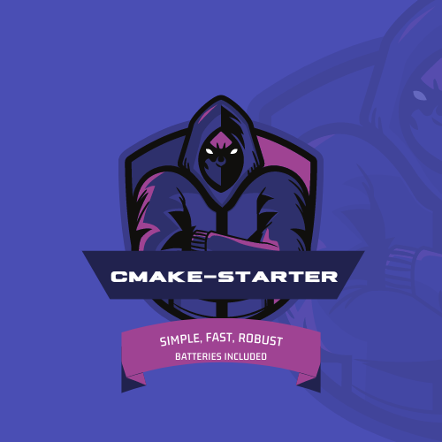

<div align="center">
  
</div>

<br>
<div align="center">
  
  
  
  
  
  
  
  
  
</div>

## :information_source: About 

> A lightweight Cmake project that uses CPM as its package manager

## :package: Docker

> This container builds the development environment for Ubuntu 20.04,
> installs the cmake project, and then runs the tests

### :keyboard: Commands

```bash
# Build the container (can be used to rebuild image after code changes)
# [e.g] docker image build -t <image-name>:<tag> .
docker image build -t cm:v0.1 .

# Rebuild with no cache
docker image build --no-cache -t cm:v0.1 .

# Run the container interactively
# [e.g] docker container run -it <image-name>:<tag>
docker container run -it cm:v0.1

# Run non interactively
docker container run cm:v0.1
```

## :package:
