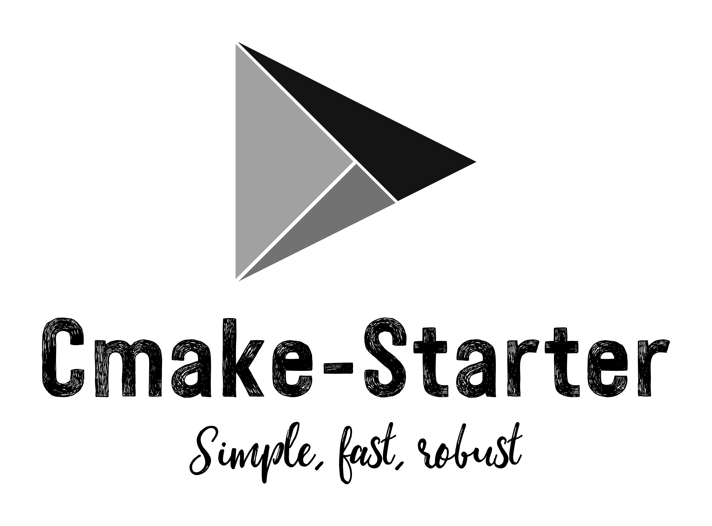

<div align="center">
  
</div>

<br>
<div align="center">
  
  
  
  
  
  
  
  
  
</div>

## :information_source: About 

> A lightweight Cmake project that uses CPM as its package manager

1. [CPM -- The missing package manager for CMake](https://github.com/cpm-cmake/CPM.cmake)
  - CPM was chosen because it is simple to set up, dependency free, and is a simple wrapper around
    Cmakes FetchContent. Most other package managers like Hunter or Conan are difficult to set up,
    make ci/cd pipelines even more difficult to set up than they already are, and have dependencies.
    
2. This templated project has 2 types of projects ready to go by default.
  - The `core` folder showcases how to set up a shared library in CMake
  - The `app` folder showcases a standard binary application which consumes the `core` shared library
  - If you just want to build a library, delete the `app` folder, and purge the CMakeLists.txt files of `app` specific code
  - IF you just want to build a regular ol' binary application, delete the `core` folder, and purge the CMakeLists.txt files or `core` specific code

## :building_construction: Compiling

> Standard cmake rules apply, the following commands should be made from the root of the project

1. `cmake -B build` Generate the make files, fetch build dependencies
2. `cmake --build build -j$(nproc)` Compile the code

> To see all the build details, read the [Dockerfile](https://github.com/mattcoding4days/cmake-starter/blob/main/Dockerfile)

### :warning: Gotchyas

> Specifics to be aware of when modifying for your own use

1. Each project has a variable named `PACKAGE_NAME`, the name of this variable
   must match the `include/<package_name>` folder.
   - e.g `core/CMakeLists.txt` PACKAGE_NAME=starter_core.
     The include folder which has all the header files for the `core` project
     is as follows: `core/include/starter_core`. If these do not match, the build will fail.
     
2. Each project **must** have a `version.hpp` file. This is to make versioning simple, you only need
   to change the version in one place. See the `cmake/utils.cmake` script to understand how this works.
     
## :computer: Docker

> This container builds the development environment for Ubuntu 20.04,
> installs the cmake project, and then runs the tests

### :keyboard: Commands

```bash
# Build the container (can be used to rebuild image after code changes)
# [e.g] docker image build -t <image-name>:<tag> .
docker image build -t cm:v0.1 .

# Rebuild with no cache
docker image build --no-cache -t cm:v0.1 .

# Run the container interactively
# [e.g] docker container run -it <image-name>:<tag>
docker container run -it cm:v0.1

# Run non interactively
docker container run cm:v0.1
```

## :package: 3rd party packages
1. [gtest](https://github.com/google/googletest)
  - Googles Unit test framework which also includes a mock library
  - Why? It compiles way faster than catch2, has a built in mocking framework, and blends nicely
    with the google benchmark library
